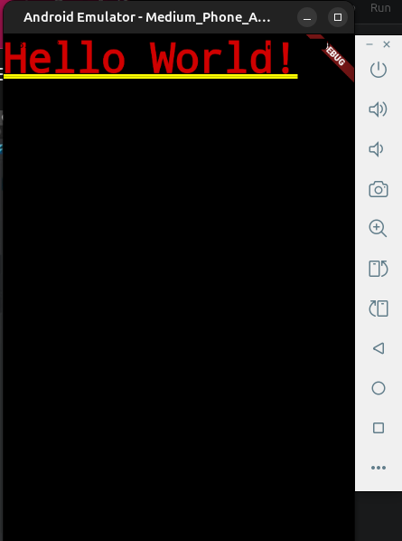
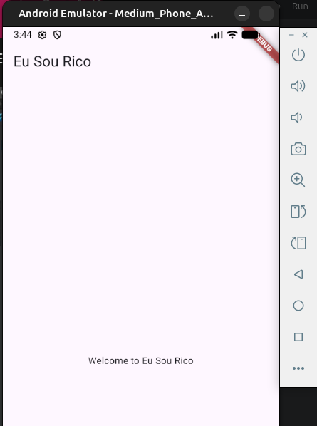

# App - Eu Sou Rico
### Step by step to build the app
1. create a new flutter project
```flutter create eu_sou_rico```

2. erase class MyApp, leaving only the following source code:
```dart
import 'package:flutter/material.dart';

void main() {
  runApp(const MyApp());
}
```

3. Replace MyApp by MaterialApp
```dart
import 'package:flutter/material.dart';

void main() {
  runApp(const MaterialApp(
    title: 'Eu Sou Rico',
    home: Text('Hello World!'),
    ),
  );
}

```

<!--
Source - https://stackoverflow.com/a/41912122
Posted by Philipp Schwarz, modified by community. See post 'Timeline' for change history
Retrieved 2026-09-26, License - CC BY-SA 4.0
-->



4. Use widget Center to put the text in the center of the screen
```dart
import 'package:flutter/material.dart';

void main() {
  runApp(const MaterialApp(
    title: 'Eu Sou Rico',
    home: Center(
      child: Text('Hello World!'),
    ),
    ),
  );
}
```

5. Add widgets Scaffold and AppBar
```dart
void main() {
  runApp(MaterialApp(
    title: 'Eu Sou Rico',
    home: Scaffold(
      appBar: AppBar(
        title: Text('Eu Sou Rico'),
      ),
      body: const Center(
        child: Text('Welcome to Eu Sou Rico'),
      ),
    ),
  ));
}
```



6. Adding a background color to the AppBar and font properties to the title.
```dart
void main() {
  runApp(MaterialApp(
    title: 'Eu Sou Rico',
    home: Scaffold(
      appBar: AppBar(
        backgroundColor: Colors.blueGrey[900],
        title: Text('Eu Sou Rico', 
          style: TextStyle(
            fontSize: 24,
            fontWeight: FontWeight.bold,
            color: Colors.white,
          ),
        ),
      ),
      body: const Center(
        child: Text('Welcome to Eu Sou Rico'),
        ),
      ),
    ),
  );
}
```